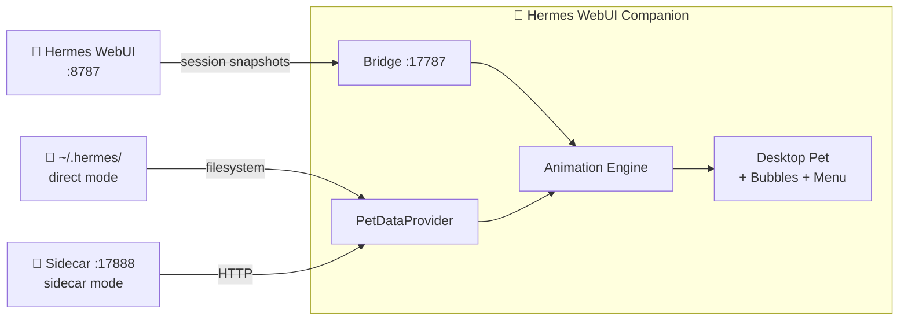

<!-- markdownlint-disable MD041 -->
<div align="center">
  <picture>
    <source media="(prefers-color-scheme: dark)" srcset="https://raw.githubusercontent.com/latipun7/hermes-webui-companion/main/crates/renderer/icons/icon.png">
    
  </picture>
  <h1 align="center">Hermes WebUI Companion</h1>
  <p align="center">
    A native desktop pet renderer for <a href="https://github.com/nousresearch/hermes-agent">Hermes Agent</a> via WebUI
    <br>
    Animated · Transparent · Always-on-top
  </p>
  <p align="center">
    <a href="#-features">Features</a> •
    <a href="#%EF%B8%8F-architecture">Architecture</a> •
    <a href="#-installation">Installation</a> •
    <a href="#-usage">Usage</a> •
    <a href="#for-developers">For Developers</a>
  </p>
  <p align="center">
    
    
    
    
  </p>
</div>

---

> **Hermes WebUI Companion** brings your [petdex](https://petdex.dev) pets to life on your desktop. It reads pets directly from your Hermes Agent installation and renders them as an animated, transparent, always-on-top window that reacts to your Hermes sessions via WebUI — idle, running, waiting for approval, or celebrating a completed session.

## ✨ Features

- **🐾 Live Pet Rendering** — Your active Hermes pet comes to life on your desktop with CSS sprite animations — no blink, no flicker, zero canvas.
- **🎭 State-Aware Animation** — The pet reacts to your Hermes sessions via WebUI: runs during processing, waits for approvals, reviews for clarifications, waves when a session completes.
- **💬 Bubble Notifications** — A sleek overlay window shows session attention items, approvals, and clarify requests.
- **🎮 Switch Pets Instantly** — Native right-click context menu (Tauri `popup_menu`) lets you switch pets without touching the terminal.
- **🪟 Always-on-Top** — Transparent, draggable window that stays above everything else.
- **🪶 Optional Sidecar** — When Hermes runs in WSL, a tiny Rust HTTP server (axum) bridges the filesystem boundary. Not needed when Hermes and the renderer share the same host.
- **🔄 Auto-Start** — When using WSL, the sidecar runs as a systemd user service and starts automatically with your system.

## 🏗️ Architecture



### Two Modes

| Mode        | When                            | How                                                |
| ----------- | ------------------------------- | -------------------------------------------------- |
| **Direct**  | Hermes & renderer on same host  | Reads `~/.hermes/` directly via filesystem         |
| **Sidecar** | Hermes in WSL, renderer on host | HTTP to sidecar at `:17888` (bridges WSL boundary) |

The renderer auto-detects the mode at startup and stays in it for the session lifetime.

| Component    | Required?         | What it does                                       |
| ------------ | ----------------- | -------------------------------------------------- |
| **Renderer** | Always            | Renders the pet, shows bubbles, handles state      |
| **Sidecar**  | WSL / remote only | Bridges `~/.hermes/` from WSL to the host via HTTP |

---

# User Guide

Everything you need to install and run Hermes WebUI Companion.

## 📦 Installation

### Prerequisites

- **[Hermes Agent](https://github.com/nousresearch/hermes-agent)** installed with a [petdex](https://petdex.dev) pet (`hermes pets install <slug>`)
- **Hermes WebUI** running at `localhost:8787` — on the same host (direct mode) or inside WSL (sidecar mode)
- **Tauri runtime** — [WebView2](https://developer.microsoft.com/en-us/microsoft-edge/webview2/) on Windows, webkit2gtk on Linux, built-in WebKit on macOS

### Step 1 — Install the Sidecar (WSL / remote only)

If Hermes runs inside WSL or on a different machine, install the sidecar to bridge the filesystem boundary. **Skip this step** if Hermes and the renderer share the same host — direct mode handles that automatically.

```bash
# Download the latest sidecar binary and service file
curl -LO https://github.com/latipun7/hermes-webui-companion/releases/latest/download/hermes-webui-companion-sidecar
curl -LO https://github.com/latipun7/hermes-webui-companion/releases/latest/download/hermes-webui-companion-sidecar.service

# Install
chmod +x hermes-webui-companion-sidecar
cp hermes-webui-companion-sidecar ~/.local/bin/
mkdir -p ~/.config/systemd/user/
cp hermes-webui-companion-sidecar.service ~/.config/systemd/user/
systemctl --user enable --now hermes-webui-companion-sidecar
```

### Step 2 — Install the Renderer

Download the latest binary for your platform from the [Releases page](https://github.com/latipun7/hermes-webui-companion/releases):

- **Windows**: `hermes-webui-companion-gui-x86_64-pc-windows-msvc.exe`
- **macOS**: `hermes-webui-companion-gui-x86_64-apple-darwin`
- **Linux**: `hermes-webui-companion-gui-x86_64-unknown-linux-gnu`

### Step 3 — Enable the WebUI Adapter

In your Hermes WebUI, make sure the Desktop Companion extension is enabled. It POSTs real-time session snapshots to the bridge server at `:17787`.

## 🎮 Usage

- **Watch the pet** — it moves and reacts based on your sessions: idle, running, waiting for approval, reviewing, waving
- **Right-click** the pet window for Restart, Close, or Switch pet
- **Notifications** appear as bubble cards above the pet
- **Click the bubble** to navigate directly to the session in WebUI
- **Drag** the pet window anywhere on your screen

## 🔧 Configuration

| Environment Variable     | Default | Description                                     |
| ------------------------ | ------- | ----------------------------------------------- |
| `HERMES_HOME`            | (auto)  | Override Hermes installation path (direct mode) |
| `HERMES_WEBUI_PORT`      | `8787`  | WebUI health check port                         |
| `HERMES_COMPANION_DEBUG` | —       | Set to `1` for verbose logging                  |

Debug logging gives you scoped prefixes:

- `[companion:bridge]` — HTTP bridge activity
- `[companion:cmd]` — Tauri IPC commands
- `[companion:health]` — Service health state
- `[companion:bubble]` — Bubble window visibility

## 📦 Release Artifacts

Each [GitHub Release](https://github.com/latipun7/hermes-webui-companion/releases) ships:

| File                                                    | Platform | Description       |
| ------------------------------------------------------- | -------- | ----------------- |
| `hermes-webui-companion-sidecar`                        | Linux    | Sidecar binary    |
| `hermes-webui-companion-sidecar.service`                | Linux    | systemd unit file |
| `hermes-webui-companion-gui-x86_64-unknown-linux-gnu`   | Linux    | Renderer binary   |
| `hermes-webui-companion-gui-x86_64-apple-darwin`        | macOS    | Renderer binary   |
| `hermes-webui-companion-gui-x86_64-pc-windows-msvc.exe` | Windows  | Renderer binary   |

---

# For Developers

Everything you need to set up the project locally, build from source, and contribute.

## 🚀 Quick Start

```sh
git clone https://github.com/latipun7/hermes-webui-companion.git
cd hermes-webui-companion
mise install
```

Assume you have [mise](https://mise.jdx.dev/installing-mise.html) installed already, this installs the Rust toolchain, prek (git hooks), and cocogitto — all in one command.

### System Dependencies (Linux only)

```bash
sudo apt-get install libwebkit2gtk-4.1-dev libgtk-3-dev \
  libayatana-appindicator3-dev librsvg2-dev
```

## 📂 Project Structure

```sh
webui-companion/
├── Cargo.toml               # Workspace root
├── .pre-commit-config.yaml  # prek hooks: fmt, clippy, prettier, markdownlint-cli2
├── rustfmt.toml             # Formatting rules
├── mise.toml                # Task runner + tool manager
├── context.md               # Domain glossary (canonical terminology)
├── crates/
│   ├── common/              # Shared types + ConfigReader
│   ├── sidecar/             # WSL HTTP server (axum)
│   └── renderer/            # Desktop app (Tauri v2)
│       ├── src/             # Rust modules
│       ├── gui/             # HTML/CSS/JS frontend
│       └── tauri.conf.json  # Tauri configuration
└── docs/
    ├── prd.md               # Product requirements
    └── adr/                 # Architecture decisions
```

## 🔨 Building

### Sidecar

```bash
cargo build --locked --release -p hermes-webui-companion-sidecar
```

### Renderer (target platform)

```bash
cargo tauri build --features gui
```

## 🧪 Running in Dev Mode

```bash
export HERMES_COMPANION_DEBUG=1
cargo tauri dev --features gui
```

## ✅ Code Quality

This project enforces:

- **Rustfmt** — consistent formatting (`mise run fmt`)
- **Clippy** — lint with `-D warnings` (`mise run check`)
- **Prettier** — code formatting for JS/CSS/JSON/YAML/MD (`mise run prettier`)
- **markdownlint** — consistent markdown (`mise run markdownlint`)
- **Conventional Commits** — enforced by `cog verify` commit-msg hook
- **Pre-commit hook** — runs fmt, clippy, prettier, markdownlint before every commit (installed by `mise install`)
- **CI** — runs the full `mise run ci-check` gate on every push/PR

### Commands

| Command              | Description                                               |
| -------------------- | --------------------------------------------------------- |
| `mise run check`     | Check Rust formatting and clippy (read-only)              |
| `mise run test`      | Run all tests                                             |
| `mise run lint`      | Fix formatting and linting issues                         |
| `mise run fmt`       | Format Rust code                                          |
| `mise run build`     | Build release binary                                      |
| `mise run ci-check`  | Full CI gate (prettier, markdownlint, fmt, clippy, tests) |
| `mise run release`   | Auto-bump version + changelog + tag                       |
| `mise run changelog` | Generate changelog from commit history                    |

## 📝 Commit Convention

This project follows [Conventional Commits](https://www.conventionalcommits.org/).
Commit messages are linted automatically via [cocogitto](https://docs.cocogitto.io/).

```sh
# With cocogitto (recommended)
cog commit feat "add awesome feature"

# With git (enforced by commit-msg hook)
git commit -m "feat: add awesome feature"
```

## 📬 Before Opening a PR

Run the full CI gate locally:

```bash
mise run ci-check
```

This runs prettier, markdownlint, fmt (check), clippy, and tests — everything CI will verify.

## 📄 License

[MIT](license) © 2026 latipun7

---

<div align="center">
  <sub>Built with 🦀 Rust & ❤️ for the Hermes ecosystem</sub>
  <br>
  <sub>Pets powered by <a href="https://petdex.dev">petdex.dev</a> — 3000+ open-source sprites</sub>
</div>
