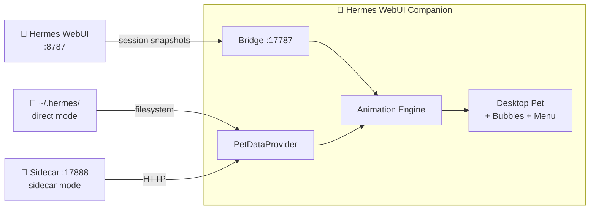

<div align="center">
  <picture>
    <source media="(prefers-color-scheme: dark)" srcset="https://raw.githubusercontent.com/latipun7/hermes-webui-companion/main/crates/renderer/icons/icon.png">
    
  </picture>
  <h1 align="center">Hermes WebUI Companion</h1>
  <p align="center">
    A native desktop pet renderer for <a href="https://github.com/nousresearch/hermes-agent">Hermes Agent</a> via WebUI
    <br>
    Animated · Transparent · Always-on-top
  </p>
  <p align="center">
    <a href="#-features">Features</a> •
    <a href="#-architecture">Architecture</a> •
    <a href="#-quick-start">Quick Start</a> •
    <a href="#-development">Development</a> •
    <a href="#-building-from-source">Building</a>
  </p>
  <p align="center">
    
    
    
    
  </p>
</div>

---

> **Hermes WebUI Companion** brings your [petdex](https://petdex.dev) pets to life on your desktop. It reads pets directly from your Hermes Agent installation and renders them as an animated, transparent, always-on-top window that reacts to your Hermes sessions via WebUI — idle, running, waiting for approval, or celebrating a completed session.

## ✨ Features

- **🐾 Live Pet Rendering** — Your active Hermes pet comes to life on your desktop with CSS sprite animations — no blink, no flicker, zero canvas.
- **🎭 State-Aware Animation** — The pet reacts to your Hermes sessions via WebUI: runs during processing, waits for approvals, reviews for clarifications, waves when a session completes.
- **💬 Bubble Notifications** — A sleek overlay window shows session attention items, approvals, and clarify requests.
- **🎮 Switch Pets Instantly** — Native right-click context menu (Tauri `popup_menu`) lets you switch pets without touching the terminal.
- **🪟 Always-on-Top** — Transparent, draggable window that stays above everything else.
- **🪶 Lightweight Sidecar** — A tiny Rust HTTP server (axum) inside WSL bridges the filesystem boundary — no Node.js, no Electron.
- **🔄 Auto-Start** — Sidecar runs as a systemd user service in WSL, starts automatically with your system.

## 🏗️ Architecture



### Two Modes

| Mode | When | How |
|------|------|-----|
| **Direct** | Hermes & renderer on same host | Reads `~/.hermes/` directly via filesystem |
| **Sidecar** | Hermes in WSL, renderer on host | HTTP to sidecar at `:17888` (bridges WSL boundary) |

The renderer auto-detects the mode at startup and stays in it for the session lifetime.

| Component    | Where           | What it does                                      |
| ------------ | --------------- | ------------------------------------------------- |
| **Sidecar**  | WSL (systemd)   | Serves pet config & spritesheets from `~/.hermes` |
| **Renderer** | Desktop (Tauri) | Renders the pet, shows bubbles, handles state     |

## ⚡ Quick Start

### Prerequisites

- **Tauri runtime** — [WebView2](https://developer.microsoft.com/en-us/microsoft-edge/webview2/) on Windows, webkit2gtk on Linux, built-in WebKit on macOS
- **Hermes Agent** with [petdex](https://petdex.dev) pet installed (`hermes pets install <slug>`)
- **WSL** with Hermes WebUI running

### 1. Install the Sidecar (WSL)

```bash
# Download the latest sidecar binary and service file
curl -LO https://github.com/latipun7/hermes-webui-companion/releases/latest/download/hermes-webui-companion-sidecar
curl -LO https://github.com/latipun7/hermes-webui-companion/releases/latest/download/hermes-webui-companion-sidecar.service

# Install
chmod +x hermes-webui-companion-sidecar
cp hermes-webui-companion-sidecar ~/.local/bin/
mkdir -p ~/.config/systemd/user/
cp hermes-webui-companion-sidecar.service ~/.config/systemd/user/
systemctl --user enable --now hermes-webui-companion-sidecar
```

### 2. Install the Renderer

Download the latest binary for your platform from the [Releases page](https://github.com/latipun7/hermes-webui-companion/releases) and make it executable:

- **Windows**: `*-x86_64-pc-windows-msvc.exe`
- **macOS**: `*-x86_64-apple-darwin`
- **Linux**: `*-x86_64-unknown-linux-gnu`

### 3. Enable the WebUI Adapter

In your Hermes WebUI, make sure the Desktop Companion extension is enabled. It POSTs real-time session snapshots to the bridge server at `:17787`.

---

### 🎮 How to Use

- **Watch the pet** — it moves and reacts based on your sessions: idle, running, waiting for approval, reviewing, waving
- **Right-click** the pet window for Restart, Close, or Switch pet
- **Notifications** appear as bubble cards above the pet
- **Click the bubble** to navigate directly to the session in WebUI
- **Drag** the pet window anywhere on your screen

## 🛠️ Development

### Project Structure

```sh
webui-companion/
├── Cargo.toml               # Workspace root
├── rustfmt.toml             # Formatting rules
├── Makefile                 # Convenience commands
├── context.md               # Domain glossary (canonical terminology)
├── .githooks/pre-commit     # Enforced linting & formatting
├── crates/
│   ├── sidecar/             # WSL HTTP server (axum)
│   └── renderer/            # Desktop app (Tauri v2)
│       ├── src/             # Rust modules
│       ├── gui/             # HTML/CSS/JS frontend
│       └── tauri.conf.json  # Tauri configuration
└── docs/
    ├── prd.md               # Product requirements
    └── adr/                 # Architecture decisions
```

### Local Setup (WSL)

```bash
# Install system dependencies (for Tauri on Linux)
sudo apt-get install libwebkit2gtk-4.1-dev libgtk-3-dev \
  libayatana-appindicator3-dev librsvg2-dev

# Clone and build
git clone https://github.com/latipun7/hermes-webui-companion.git
cd hermes-webui-companion
cargo build --release -p hermes-webui-companion-sidecar

# Run tests
cargo test --workspace --all-targets --all-features
```

### Run the Renderer

```bash
# All platforms — set debug mode, then run with Tauri
export HERMES_COMPANION_DEBUG=1
cd crates/renderer
cargo tauri dev --features gui
```

### Code Quality

This project enforces:

- **Rustfmt** — consistent formatting (`cargo fmt --all`)
- **Clippy** — lint with `-D warnings` (`make clippy`)
- **Pre-commit hook** — runs both before every commit (`make setup-hooks`)
- **CI** — fmt → clippy → test on every push/PR

## 🏗️ Building from Source

### Sidecar (any platform)

```bash
cargo build --locked --release -p hermes-webui-companion-sidecar
```

### Renderer (target platform)

```bash
cd crates/renderer
npx @tauri-apps/cli@latest build --features gui
```

Or use the release workflow — just push a tag and CI builds everything:

```bash
git tag v0.1.0
git push origin v0.1.0
```

## 🔧 Configuration

| Environment Variable     | Default | Description                    |
| ------------------------ | ------- | ------------------------------ |
| `HERMES_COMPANION_DEBUG` | —       | Set to `1` for verbose logging |
| `HERMES_WEBUI_PORT`      | `8787`  | WebUI health check port        |
| `CARGO_TARGET_DIR`       | —       | Custom build output directory  |

Debug logging gives you scoped prefixes:

- `[companion:bridge]` — HTTP bridge activity
- `[companion:cmd]` — Tauri IPC commands
- `[companion:health]` — Service health state
- `[companion:bubble]` — Bubble window visibility

## 📦 Release Artifacts

Each [GitHub Release](https://github.com/latipun7/hermes-webui-companion/releases) ships:

| File | Platform | Description |
|------|----------|-------------|
| `hermes-webui-companion-sidecar` | Linux | Sidecar binary |
| `hermes-webui-companion-sidecar.service` | Linux | systemd unit file |
| `*-x86_64-unknown-linux-gnu` | Linux | Renderer binary |
| `*-x86_64-apple-darwin` | macOS | Renderer binary |
| `*-x86_64-pc-windows-msvc.exe` | Windows | Renderer binary |

## 📚 Documentation

- [**context.md**](context.md) — Canonical domain glossary (all project terminology)
- [**docs/prd.md**](docs/prd.md) — Product requirements
- [**docs/adr/**](docs/adr/) — Architecture Decision Records (sequentially numbered)
- [**agents.md**](agents.md) — AI agent context (architecture, build commands, critical gotchas)

## 🤝 Contributing

1. Fork the repo
2. Install pre-commit hooks: `make setup-hooks`
3. Create a feature branch
4. Make your changes (fmt + clippy enforced)
5. Open a pull request

Before opening a PR, run the full CI gate locally:

```bash
make ci
```

## 📄 License

[MIT](license) © 2026 latipun7

---

<div align="center">
  <sub>Built with 🦀 Rust & ❤️ for the Hermes ecosystem</sub>
  <br>
  <sub>Pets powered by <a href="https://petdex.dev">petdex.dev</a> — 3000+ open-source sprites</sub>
</div>
