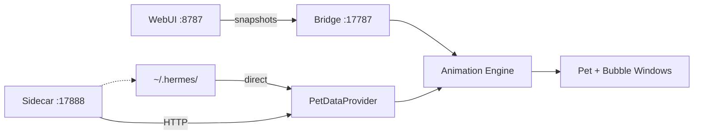

# hermes-webui-companion

Desktop companion renderer for Hermes Agent — a cross-platform desktop pet window
that reacts to companion state in real-time.

> **Domain glossary:** [`context.md`](context.md) — canonical terminology
> **PRD:** [`docs/prd.md`](docs/prd.md) · **ADRs:** `docs/adr/`

## Architecture



- **Direct mode**: renderer reads `~/.hermes/` via filesystem (same host)
- **Sidecar mode**: renderer HTTP → sidecar → reads `~/.hermes/` (WSL → host bridge)
- **Bridge server** (`:17787`, tiny_http): receives WebUI snapshots, independent of pet data source
- Mode detected at startup, static for session lifetime

## Project Layout

```
webui-companion/
├── Cargo.toml              # workspace root
├── Makefile                # fmt, clippy, test, ci, setup-hooks
├── .githooks/pre-commit    # fmt --check + clippy -D warnings
├── .github/workflows/ci.yml
├── context.md              # domain glossary
├── docs/
│   ├── prd.md
│   ├── adr/                 # architecture decisions
│   └── hermes-webui-companion-sidecar.service
├── crates/
│   ├── sidecar/            # axum HTTP server (WSL)
│   └── renderer/           # Tauri v2 app (Windows)
│       ├── src/            # Rust — animation, bridge, sidecar_client, sprite
│       └── gui/            # Frontend — vanilla HTML/CSS/JS, no npm
```

## Build & Run

### Sidecar (WSL)

```bash
cargo build -p hermes-webui-companion-sidecar --release
systemctl --user status hermes-webui-companion-sidecar
```

### Renderer GUI (host OS)

```bash
export HERMES_COMPANION_DEBUG=1
cd crates/renderer
cargo tauri dev --features gui
```

## Tests

```bash
cargo test --locked --workspace --all-targets --all-features
```

## Code Quality

Workspace lints (`Cargo.toml`): `unsafe_code=deny`, `rust_2018_idioms=deny`, `rust_2024_compatibility=deny`, `clippy::all=warn`. Crates inherit via `[lints] workspace = true`.

Pre-commit (`.githooks/pre-commit`): `cargo fmt --check --all` + `cargo clippy --locked --workspace --all-targets --all-features -- -D warnings`. Install: `git config core.hooksPath .githooks`.

CI (`.github/workflows/ci.yml`): fmt → clippy → test, all with `--locked --all-features`.

Makefile: `make check` (fmt + clippy), `make test`, `make ci` (check + test), `make setup-hooks`.

## Critical Gotchas

- **Tauri v2 `withGlobalTauri: true`** — required in `tauri.conf.json`. Without it, `window.__TAURI__` is `undefined` and all IPC silently fails.
- **CSP disabled** (`csp: null`) — desktop-only app, intentional. Do not re-enable.
- **Feature-gated Tauri** — `gui` feature keeps Tauri deps optional so library tests run without webkit2gtk in WSL.
- **`[lints] workspace = true`** — per-crate TOML `[lints]` section, NOT `package.lints.workspace = true` (Cargo 1.96 quirk).
- **`edition.workspace = true`** — edition inherited from workspace `[package]`, no per-crate duplication.
- **`--locked` + `--all-features`** — all cargo commands in CI/hooks/Makefile pin deps and compile every feature.
- **`SidecarClient::check_health()`** — application-level (hits `GET /health`, checks `{"ok":true}`), NOT raw TCP connect.
- **`tiny_http` for bridge** — synchronous, no tokio runtime. Handler functions are pure and testable without HTTP server.
- **`#![windows_subsystem = "windows"]`** — suppresses console window on release builds.

## Dependencies

- **Rust**: stable, edition 2024
- **Tauri**: v2 (gui feature)
- **Sidecar**: axum, tokio, serde_yaml_ng
- **Renderer**: ureq (json feature), image, tiny_http, serde, tauri-plugin-process
- **Frontend**: vanilla HTML/CSS/JS (no npm)
