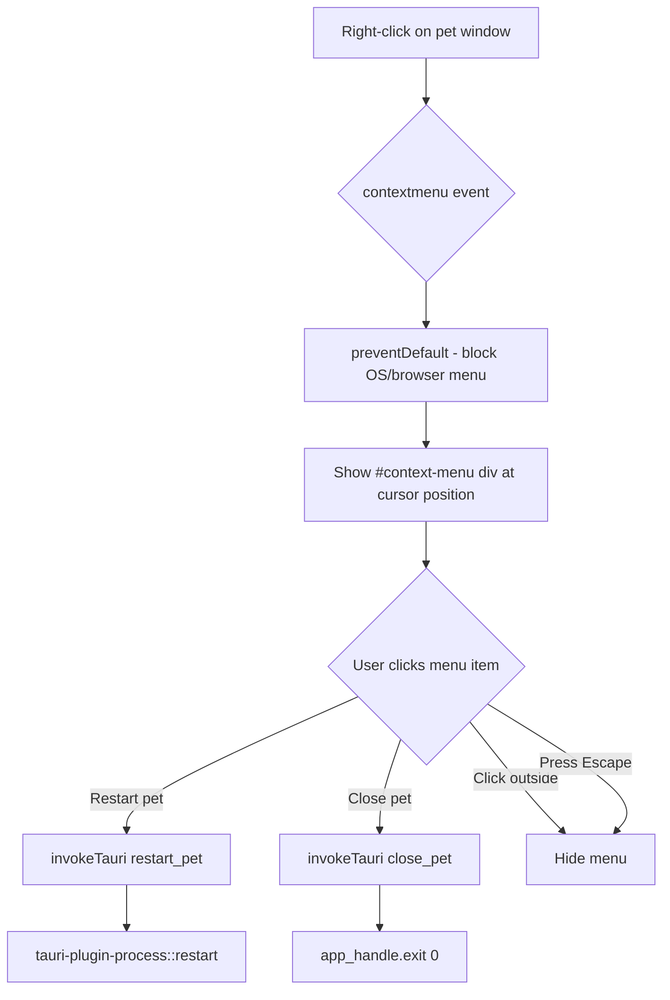

# ADR: Right-Click Context Menu on Pet Window

**Status:** Proposed  
**Date:** 2026-06-30  
**Author:** Latif + Hermes

---

## ADR-001: Custom HTML/CSS Context Menu over Native OS Menu

### Context

The pet window uses `decorations: false` and `-webkit-app-region: drag` on the body element. Currently:

- Right-click on drag region → Windows system window menu (Restore/Move/Size/Minimize/Maximize/Close)
- Right-click on no-drag region (bubble toggle button) → WebView2 browser default context menu (Back/Refresh/Save as/Print/More tools)

Neither menu is controllable — they're OS/browser defaults. We need a context menu with custom items: "Restart pet" and "Close pet".

We cannot get a truly native OS context menu because the window has no title bar (`decorations: false`). Tauri v2's window menu API requires a native menu bar, which doesn't exist in a frameless window.

### Decision

**Intercept `contextmenu` event in JavaScript and render a custom HTML/CSS context menu** styled to match native Windows 11 dark context menus.



### Consequences

**Positive:**
- Full control over menu items, styling, and behavior
- Zero dependency on OS-specific window menu APIs
- Consistent appearance across Windows/macOS/Linux
- Menu can be styled to match the existing dark frosted glass design language

**Negative:**
- Not a truly native OS menu — no platform-specific accessibility features (screen reader integration, keyboard navigation via Alt+Space)
- Requires JavaScript event handling in the WebView
- Menu dismiss behavior (click outside, Escape) must be implemented manually

### Styling Specification

- **Background:** `rgba(18, 18, 22, 0.92)` with `backdrop-filter: blur(12px)`
- **Border:** `1px solid rgba(255, 255, 255, 0.08)`
- **Border radius:** `8px` (matches Windows 11 context menu)
- **Font:** Segoe UI, system-ui, 12px
- **Item height:** `32px`, padding `8px 12px`
- **Hover:** `rgba(255, 255, 255, 0.08)` background
- **Width:** `180px` minimum
- **Shadow:** `0 8px 32px rgba(0, 0, 0, 0.4)`
- **Animation:** Fade-in 100ms ease-out
- **Position:** At cursor, auto-flip if near window edges

---

## ADR-002: `tauri-plugin-process` for Restart

### Context

"Restart pet" means a heavy restart — kill the current Tauri process and spawn a fresh one. This needs the current executable to exit cleanly while ensuring the new process starts reliably.

Options considered:
- **A:** `tauri-plugin-process` — official Tauri plugin with `restart()` API
- **B:** Manual `Command::new(current_exe).spawn()` + `std::process::exit(0)` — zero deps but potential race condition between spawn and exit

### Decision

**Use `tauri-plugin-process` (Option A).**

```rust
// Cargo.toml
tauri-plugin-process = { version = "2", optional = true }

// gui.rs
.plugin(tauri_plugin_process::init())

// commands.rs
#[tauri::command]
fn restart_pet(app: tauri::AppHandle) {
    use tauri_plugin_process::ProcessExt;
    app.restart();
}
```

### Consequences

**Positive:**
- Clean, well-tested restart mechanism
- No race condition between spawn and exit
- Handles platform-specific edge cases (process group cleanup on Windows, etc.)
- ~200KB additional binary size (acceptable trade-off)

**Negative:**
- New dependency added to the project
- Plugin API may change with Tauri v2 updates (currently stable in v2.x)

---

## ADR-003: Close Pet Exits All Windows

### Context

The pet renderer manages two Tauri windows: `main` (pet sprite) and `bubbles` (notification overlay). "Close pet" must terminate both.

### Decision

**Use `app_handle.exit(0)` to quit the entire Tauri application.** No per-window close — this ensures the bubble window doesn't become orphaned.

```rust
#[tauri::command]
fn close_pet(app: tauri::AppHandle) {
    app.exit(0);
}
```

No confirmation dialog — the menu provides clear intent through its label.

### Consequences

**Positive:**
- Simple, reliable — no window lifecycle race conditions
- Both windows terminate atomically

**Negative:**
- No "are you sure?" — accidental right-click → close is possible but unlikely (requires right-click + click on "Close pet")

---

## ADR-004: Context Menu Trigger Area

### Context

The pet window has a bubble toggle button (top-right, `-webkit-app-region: no-drag`, `cursor: pointer`). Should right-click on this button show the custom context menu or the browser default?

### Decision

**Intercept `contextmenu` on the entire `document`, including the bubble toggle area.** The `click` and `contextmenu` events are independent — intercepting right-click does not affect left-click behavior on the button.

```javascript
document.addEventListener("contextmenu", (e) => {
    e.preventDefault();
    showContextMenu(e.clientX, e.clientY);
});
```

### Consequences

**Positive:**
- Uniform right-click behavior across the entire pet window
- Simpler implementation — single event listener on document
- Bubble toggle left-click behavior unchanged

**Negative:**
- User cannot access browser DevTools via right-click → "Inspect" (but DevTools is already enabled via `devtools: true` in tauri.conf.json, accessible via F12 or Tauri menu)
