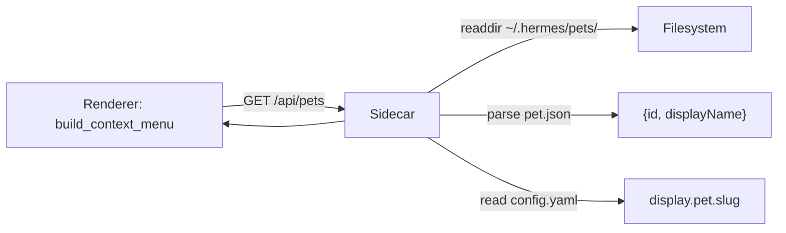
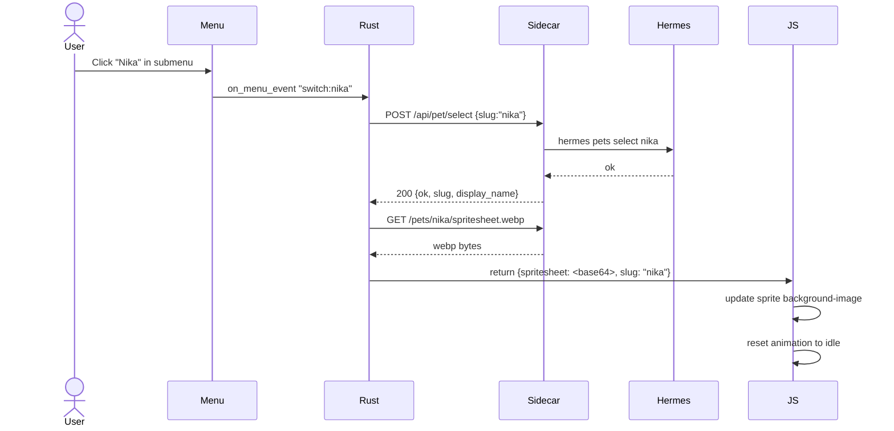

# ADR: Switch Pet via Context Menu Submenu

**Status:** Proposed
**Date:** 2026-06-30
**Author:** Latif + Hermes

---

## ADR-001: Sidecar Endpoint for Pet Listing

### Context

The renderer needs a list of all installed pets to populate the "Switch pet" submenu. Currently the sidecar only exposes `GET /api/pet/active` (single pet). We need a new endpoint that lists all pets from `~/.hermes/pets/`.

### Decision

**Add `GET /api/pets` endpoint** that reads all directories under `~/.hermes/pets/`, parses each `pet.json` for `displayName`, and returns:

```json
{
  "pets": [
    { "slug": "doraemon", "display_name": "Doraemon" },
    { "slug": "nika", "display_name": "Nika" }
  ],
  "active": "nika"
}
```

The `active` field tells the renderer which pet to show as checked in the submenu.



### Consequences

**Positive:**

- Single source of truth — sidecar is already the bridge to `~/.hermes/pets/`
- `displayName` from `pet.json` gives human-readable names in the menu
- `active` field enables checkmark without extra API call

**Negative:**

- New endpoint = additional surface area (tests, error handling, CORS)
- If `pet.json` is malformed for one pet, the whole list fails — need graceful skip

---

## ADR-002: Pet Selection via `hermes pets select`

### Context

When the user clicks a pet in the submenu, we need to persist the selection so it survives renderer restarts. The canonical way is `hermes pets select <slug>` which writes `display.pet.slug` and `display.pet.enabled` to `~/.hermes/config.yaml`.

### Decision

**Sidecar shells out to `hermes pets select <slug>`** via `POST /api/pet/select`. The sidecar already reads `config.yaml` — shelling out delegates the write to Hermes' own CLI, avoiding config format assumptions or race conditions.

```
POST /api/pet/select {"slug": "nika"}
  → sidecar: std::process::Command::new("hermes")
      .args(["pets", "select", "nika"])
      .output()
  → 200 {"ok": true, "slug": "nika", "display_name": "Nika"}
  → on error: 500 {"error": "hermes pets select failed: ..."}
```

### Consequences

**Positive:**

- No config format coupling — Hermes CLI is the sole writer of `config.yaml`
- Respects any future Hermes config schema changes
- Sidecar stays thin (no YAML write logic needed)

**Negative:**

- `hermes` must be on PATH inside WSL
- Subprocess overhead (~50ms) — negligible for a menu click
- Error surface: `hermes` not installed, pet slug invalid, config locked

---

## ADR-003: In-Place Spritesheet Reload (No Restart)

### Context

After selecting a new pet, the renderer must display the new spritesheet immediately. Restarting the Tauri process (as "Restart pet" does) is heavy — flickers, reconnects sidecar, resets animation state. A smoother UX reloads the spritesheet in-place.

### Decision

**After `switch_pet` succeeds, fetch the new spritesheet and update the frontend without restarting the process.**



The `switch_pet` Tauri command wraps both steps (select + fetch spritesheet) into one IPC call, returning the new spritesheet as base64 bytes.

### Consequences

**Positive:**

- Smooth UX — no flicker, no restart
- Single IPC call from frontend perspective
- Animation state preserved (stays idle after switch, waits for next WebUI snapshot)

**Negative:**

- More complex than restart-based approach
- Error handling: if spritesheet fetch fails after successful select, renderer shows error indicator with text

---

## ADR-004: Error State After Failed Switch

### Context

If spritesheet fetch fails after successful `hermes pets select`, the renderer is now configured for a pet whose spritesheet is unavailable.

### Decision

**Show the error indicator ("!" with red background) plus a short error text below it.** The pet window stays in error state with the text visible. The next state poll continues — if sidecar recovers or user switches to a valid pet, the error clears.

### Consequences

**Positive:**

- User knows exactly what failed (not just a silent "!")
- Recovers automatically on next successful state poll
- No need to restart

**Negative:**

- Error text in a 172×186px window is tight — need small font, auto-wrap
- Error indicator currently covers entire sprite area; need to preserve bubble toggle access
