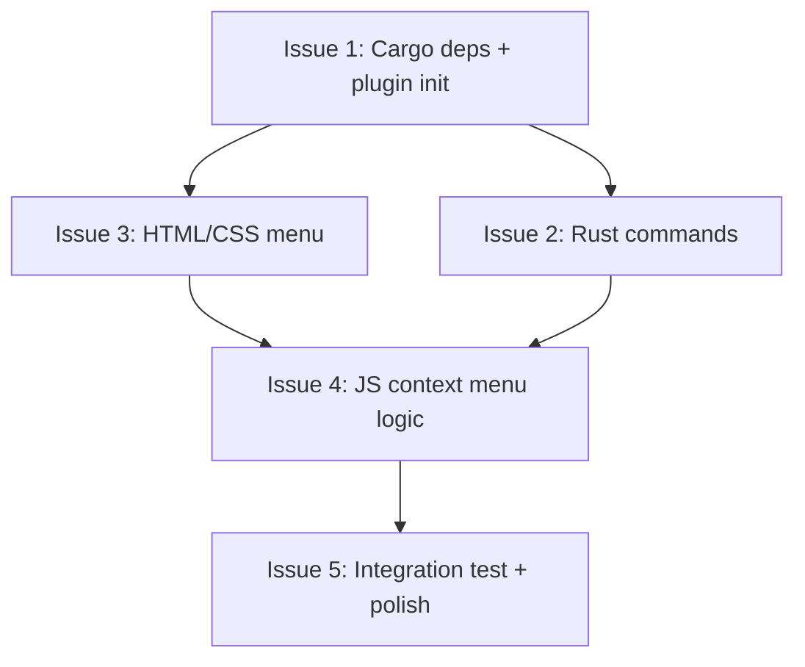

# Issues — Right-Click Context Menu

Tracer-bullet vertical slices for implementing the right-click context menu on the pet window.

**Status:** Ready for implementation  
**Date:** 2026-06-30

---



---

## Issue 1: Add `tauri-plugin-process` dependency and register plugin

**Priority:** P0 — Blocker  
**Estimate:** S (15 min)  
**Blocked by:** None  
**Blocks:** Issue 2, Issue 3

### Scope

- Add `tauri-plugin-process` to `crates/renderer/Cargo.toml` under `[dependencies]` with `optional = true`
- Add it to the `gui` feature flag list
- Register the plugin in `gui.rs` builder: `.plugin(tauri_plugin_process::init())`

### Files

| File | Change |
|------|--------|
| `crates/renderer/Cargo.toml` | Add dep + feature |
| `crates/renderer/src/gui.rs` | Register plugin |

### Acceptance Criteria

- [ ] `cargo build -p hermes-webui-companion-renderer --features gui` compiles without errors
- [ ] Plugin registers without panic at startup

---

## Issue 2: Implement `close_pet` and `restart_pet` Tauri commands

**Priority:** P0 — Blocker  
**Estimate:** S (20 min)  
**Blocked by:** Issue 1  
**Blocks:** Issue 4

### Scope

Add two new `#[tauri::command]` handlers in `commands.rs`:

```rust
#[tauri::command]
pub fn close_pet(app: tauri::AppHandle) {
    app.exit(0);
}

#[tauri::command]
pub fn restart_pet(app: tauri::AppHandle) {
    use tauri_plugin_process::ProcessExt;
    app.restart();
}
```

Register both in `gui.rs` `invoke_handler` list plus add the plugin import.

### Files

| File | Change |
|------|--------|
| `crates/renderer/src/commands.rs` | Add 2 command functions |
| `crates/renderer/src/gui.rs` | Register commands + add `use tauri_plugin_process` import |

### Acceptance Criteria

- [ ] `cargo test --workspace` — all 55 tests still pass
- [ ] New commands appear in `invoke_handler` list
- [ ] Compiles with `--features gui`

---

## Issue 3: Create context menu HTML + CSS in index.html

**Priority:** P0 — Blocker  
**Estimate:** M (30 min)  
**Blocked by:** None (parallel with Issue 1-2)  
**Blocks:** Issue 4

### Scope

Add a hidden `<div id="context-menu">` to `index.html` with CSS matching the frosted glass design spec:

- **Background:** `rgba(18, 18, 22, 0.92)`
- **Backdrop filter:** `blur(12px)`
- **Border:** `1px solid rgba(255, 255, 255, 0.08)`
- **Border radius:** `8px`
- **Shadow:** `0 8px 32px rgba(0, 0, 0, 0.4)`
- **Width:** `min(180px, calc(100vw - 16px))`
- **Overflow:** hidden
- **Position:** fixed, initially hidden (`display: none`)
- **Z-index:** `100` (above pet sprite, above bubble toggle)

Menu items as `<div>` children:

```html
<div id="context-menu">
  <div class="ctx-item" data-action="restart">Restart pet</div>
  <div class="ctx-separator"></div>
  <div class="ctx-item" data-action="close">Close pet</div>
</div>
```

Item styling:
- **Height:** `32px`, **padding:** `8px 12px`
- **Font:** `system-ui, Segoe UI, sans-serif`, **size:** `12px`
- **Color:** `rgba(255, 255, 255, 0.85)`
- **Hover:** `background: rgba(255, 255, 255, 0.08)`
- **Cursor:** `pointer`
- **`-webkit-app-region: no-drag`** (must be interactive)

Separator: `1px solid rgba(255, 255, 255, 0.06)`, margin `4px 0`

Fade-in animation:
```css
@keyframes ctx-fade-in {
  from { opacity: 0; transform: scale(0.96); }
  to   { opacity: 1; transform: scale(1); }
}
#context-menu.show {
  display: block;
  animation: ctx-fade-in 0.1s ease-out;
}
```

### Files

| File | Change |
|------|--------|
| `crates/renderer/gui/index.html` | Add context menu HTML + full CSS |

### Acceptance Criteria

- [ ] Menu renders as hidden div in DOM
- [ ] Styling matches frosted glass spec (visual check on Windows build)
- [ ] No visual regression to existing pet window appearance
- [ ] Hover states work on menu items
- [ ] Separator line renders correctly

---

## Issue 4: Implement context menu JavaScript logic in pet.js

**Priority:** P0 — Blocker  
**Estimate:** M (45 min)  
**Blocked by:** Issue 2, Issue 3  
**Blocks:** Issue 5

### Scope

Add context menu JavaScript to `pet.js` with the following functions:

```javascript
// ── Context Menu ──────────────────────────────────────────

const ctxMenu = document.getElementById("context-menu");
let ctxVisible = false;

function showContextMenu(x, y) {
    if (!ctxMenu) return;
    
    // Auto-flip: if near right/bottom edge, shift menu
    const menuW = ctxMenu.offsetWidth || 180;
    const menuH = ctxMenu.offsetHeight || 72;
    const winW = window.innerWidth;
    const winH = window.innerHeight;
    
    let left = x;
    let top = y;
    
    if (x + menuW > winW) left = x - menuW;
    if (y + menuH > winH) top = y - menuH;
    
    ctxMenu.style.left = left + "px";
    ctxMenu.style.top = top + "px";
    ctxMenu.classList.add("show");
    ctxVisible = true;
}

function hideContextMenu() {
    if (!ctxMenu) return;
    ctxMenu.classList.remove("show");
    ctxVisible = false;
}

function setupContextMenu() {
    // Intercept right-click on entire document
    document.addEventListener("contextmenu", (e) => {
        e.preventDefault();
        showContextMenu(e.clientX, e.clientY);
    });
    
    // Dismiss on click outside
    document.addEventListener("click", (e) => {
        if (ctxVisible && !ctxMenu.contains(e.target)) {
            hideContextMenu();
        }
    });
    
    // Dismiss on Escape
    document.addEventListener("keydown", (e) => {
        if (e.key === "Escape" && ctxVisible) {
            hideContextMenu();
        }
    });
    
    // Handle menu item clicks
    ctxMenu.addEventListener("click", async (e) => {
        const item = e.target.closest(".ctx-item");
        if (!item) return;
        
        const action = item.dataset.action;
        hideContextMenu();
        
        if (action === "restart") {
            await invokeTauri("restart_pet").catch(() => {});
        } else if (action === "close") {
            await invokeTauri("close_pet").catch(() => {});
        }
    });
}
```

Call `setupContextMenu()` in `main()` after `setupBubbleToggle()`.

### Files

| File | Change |
|------|--------|
| `crates/renderer/gui/pet.js` | Add context menu functions + call in `main()` |

### Acceptance Criteria

- [ ] Right-click anywhere on pet window shows custom frosted glass menu
- [ ] Menu appears at cursor position
- [ ] Menu auto-flips when near right/bottom edges
- [ ] Left-click on bubble toggle still works (toggles bubble)
- [ ] Clicking "Restart pet" → Tauri process restarts, pet reloads
- [ ] Clicking "Close pet" → both pet window and bubble window close
- [ ] Click outside menu → menu dismisses
- [ ] Press Escape → menu dismisses
- [ ] Browser default right-click menu never appears

---

## Issue 5: Integration test + cleanup

**Priority:** P1 — Important  
**Estimate:** S (20 min)  
**Blocked by:** Issue 4  
**Blocks:** None (final)

### Scope

- Run `cargo test --workspace` — verify all 55 existing tests still pass
- Run `cargo build -p hermes-webui-companion-renderer --features gui` — verify clean compile
- Visual smoke test on Windows:
  - Right-click → menu appears
  - Click "Close pet" → app exits cleanly
  - Re-launch, right-click → "Restart pet" → pet reloads
  - Verify bubble toggle left-click still works
  - Verify pet dragging still works
  - Verify animation state changes still work
- Remove any dead code or unused imports

### Files

| File | Change |
|------|--------|
| N/A | Verification only |

### Acceptance Criteria

- [ ] 55 tests still pass (no regressions)
- [ ] Clean compile with `--features gui`
- [ ] Visual smoke test passes on Windows
- [ ] No new warnings in build output
