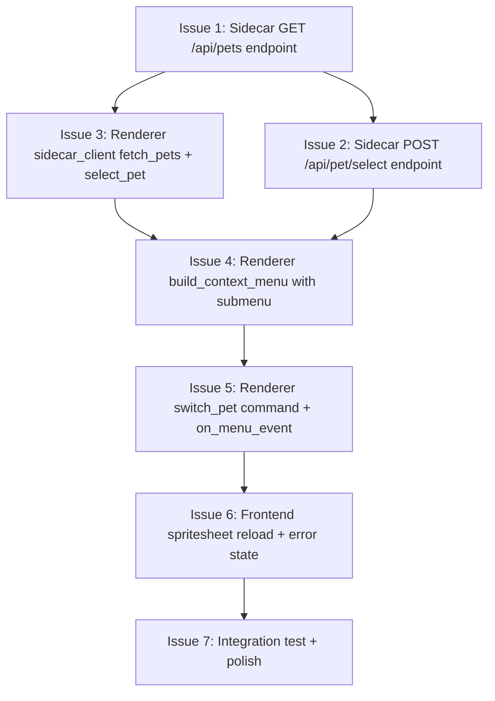

# Issues — Switch Pet Context Menu

Tracer-bullet vertical slices for adding a "Switch pet" submenu to the right-click context menu.

**Status:** Complete ✅ — [PR #19](https://github.com/latipun7/hermes-webui-companion/pull/19) merged 2026-06-30
**Date:** 2026-06-30

---



---

## Issue 1: Add `GET /api/pets` endpoint to sidecar

**Priority:** P0 — Blocker
**Estimate:** M (30 min)
**Blocked by:** None
**Blocks:** Issue 3

### Scope

Add a new axum handler that:

1. Reads all directories under `~/.hermes/pets/`
2. For each directory, reads `pet.json` and extracts `id` and `displayName`
3. Gracefully skips directories without valid `pet.json` (logs warning, continues)
4. Reads `display.pet.slug` from `config.yaml` to determine `active`
5. Returns `{"pets": [...], "active": "doraemon"}`

Router: `.route("/api/pets", get(list_pets))`

### Files

| File                         | Change                                   |
| ---------------------------- | ---------------------------------------- |
| `crates/sidecar/src/main.rs` | Add `list_pets` handler + register route |

### Acceptance Criteria

- [ ] `curl http://127.0.0.1:17888/api/pets` returns JSON list with slugs + display_names + active
- [ ] Directory without `pet.json` is skipped (not 500)
- [ ] 6 existing sidecar tests still pass
- [ ] New integration test: `list_pets_returns_installed_pets`

---

## Issue 2: Add `POST /api/pet/select` endpoint to sidecar

**Priority:** P0 — Blocker
**Estimate:** S (20 min)
**Blocked by:** None (parallel with Issue 1)
**Blocks:** Issue 3

### Scope

Add an axum handler that:

1. Accepts `{"slug": "nika"}`
2. Runs `hermes pets select nika` via `std::process::Command`
3. On success: returns `200 {"ok": true, "slug": "nika", "display_name": "Nika"}`
4. On failure: returns `500 {"error": "hermes pets select failed: <stderr>"}`
5. Reads `pet.json` for `displayName` to include in response

Router: `.route("/api/pet/select", post(select_pet))`

### Files

| File                         | Change                                    |
| ---------------------------- | ----------------------------------------- |
| `crates/sidecar/src/main.rs` | Add `select_pet` handler + register route |

### Acceptance Criteria

- [ ] `curl -X POST http://127.0.0.1:17888/api/pet/select -d '{"slug":"nika"}'` returns 200
- [ ] `~/.hermes/config.yaml` updated with new slug
- [ ] Invalid slug returns 500 with error message
- [ ] New integration test: `select_pet_changes_active`

---

## Issue 3: Add `fetch_pets()` and `select_pet()` to SidecarClient

**Priority:** P0 — Blocker
**Estimate:** S (20 min)
**Blocked by:** Issue 1, Issue 2
**Blocks:** Issue 4, Issue 5

### Scope

Add two new methods to `SidecarClient`:

```rust
/// List all installed pets with display names.
pub fn fetch_pets(&self) -> Result<PetListResponse, SidecarError>;

/// Select a new active pet via hermes pets select.
pub fn select_pet(&self, slug: &str) -> Result<SelectPetResponse, SidecarError>;
```

Add response structs: `PetListResponse`, `PetEntry`, `SelectPetResponse`.

### Files

| File                                    | Change                               |
| --------------------------------------- | ------------------------------------ |
| `crates/renderer/src/sidecar_client.rs` | Add 2 methods + 3 structs + 4+ tests |

### Acceptance Criteria

- [ ] `fetch_pets()` returns list with `active` field
- [ ] `select_pet("nika")` succeeds for valid slug
- [ ] Unit tests: `fetch_pets_success`, `select_pet_success`, `select_pet_invalid_slug`
- [ ] 8 existing client tests still pass

---

## Issue 4: Refactor `build_context_menu()` with "Switch pet" submenu

**Priority:** P0 — Blocker
**Estimate:** M (45 min)
**Blocked by:** Issue 3
**Blocks:** Issue 5

### Scope

Refactor `build_context_menu()` in `commands.rs` to:

1. Call `SidecarClient::fetch_pets()` at menu build time
2. Build a parent menu item "Switch pet"
3. Build a `Submenu` with child items for each pet (slug as id: `"switch:nika"`)
4. Add checkmark (✓ prefix or `MenuItemBuilder::selected()`) for the active pet
5. Append separator + existing "Restart pet" and "Close pet" items

Resulting menu structure:

```
Switch pet          ▸
  ✓ Doraemon
    Nika
─────────────────
Restart pet
Close pet
```

Handle sidecar unavailable: show "Switch pet (unavailable)" as disabled item.

### Files

| File                              | Change                          |
| --------------------------------- | ------------------------------- |
| `crates/renderer/src/commands.rs` | Refactor `build_context_menu()` |

### Acceptance Criteria

- [ ] Context menu shows submenu with installed pets
- [ ] Active pet has checkmark
- [ ] Sidecar down → "Switch pet" shown as disabled
- [ ] Empty pets dir → "Switch pet" shown as disabled or empty submenu
- [ ] Menu item IDs are `"switch:<slug>"` for routing

---

## Issue 5: Add `switch_pet` command + handle `"switch:*"` events

**Priority:** P0 — Blocker
**Estimate:** M (30 min)
**Blocked by:** Issue 2, Issue 3, Issue 4
**Blocks:** Issue 6

### Scope

Add `switch_pet` Tauri command:

```rust
#[tauri::command]
pub fn switch_pet(slug: String) -> Result<serde_json::Value, String> {
    // 1. call sidecar_client.select_pet(&slug)
    // 2. call sidecar_client.fetch_spritesheet(&slug)
    // 3. return {spritesheet: <base64>, slug, display_name}
}
```

Update `on_menu_event` in `gui.rs` to handle `"switch:*"` — extract slug from ID, call `switch_pet`, and return result to frontend.

Register `switch_pet` in `invoke_handler`.

### Files

| File                              | Change                                    |
| --------------------------------- | ----------------------------------------- |
| `crates/renderer/src/commands.rs` | Add `switch_pet` command                  |
| `crates/renderer/src/gui.rs`      | Register command + extend `on_menu_event` |

### Acceptance Criteria

- [ ] `switch_pet("nika")` returns spritesheet bytes + metadata
- [ ] `on_menu_event` routes `"switch:nika"` correctly
- [ ] Invalid slug returns error (not panic)
- [ ] 56 existing tests still pass

---

## Issue 6: Frontend spritesheet reload after switch

**Priority:** P0 — Blocker
**Estimate:** M (30 min)
**Blocked by:** Issue 5
**Blocks:** Issue 7

### Scope

The `on_menu_event` handler currently runs in Rust — it can call `switch_pet` but needs to communicate the result back to the frontend. Options:

**A: Tauri event** — `app.emit("pet-switched", payload)` → JS listens and updates sprite
**B: Frontend polls** — after menu close, frontend re-fetches active pet + spritesheet
**C: Direct IPC** — menu event handler triggers a JS callback via `window.eval()`

Choose **Option B** (simplest): after menu dismisses, `pet.js` polls `get_companion_state` as usual. Since `switch_pet` already updated the config, the next `get_active_pet` call will return the new pet. The frontend detects slug change and reloads the spritesheet.

Update `pet.js`:

- After `setupContextMenu()` dismisses (menu hidden), trigger `reloadSpritesheet()`
- `reloadSpritesheet()` calls `invokeTauri("get_active_pet")` → if slug changed, call `invokeTauri("get_spritesheet")` → update `backgroundImage` → reset animation
- Show loading state (brief) during reload

Error state: if spritesheet load fails, show "!" indicator + error text overlay

### Files

| File                         | Change                                                           |
| ---------------------------- | ---------------------------------------------------------------- |
| `crates/renderer/gui/pet.js` | Add `reloadSpritesheet()`, polling after menu close, error state |

### Acceptance Criteria

- [ ] Selecting new pet from menu → spritesheet updates within ~500ms
- [ ] Animation resets to idle on new pet
- [ ] Failed spritesheet → error indicator with text shown
- [ ] Bubble toggle still accessible during error state
- [ ] Existing pet animations still work

---

## Issue 7: Integration test + docs

**Priority:** P1 — Important
**Estimate:** S (20 min)
**Blocked by:** Issue 6
**Blocks:** None (final)

### Scope

- `cargo test --workspace` — all tests pass (sidecar + renderer)
- Update PRD with switch pet feature
- Update `docs/adr-right-click-menu.md` to reference switch pet ADR
- Clean up unused imports, dead code

### Files

| File          | Change                         |
| ------------- | ------------------------------ |
| `docs/prd.md` | Add switch pet to user stories |
| N/A           | Verification only              |

### Acceptance Criteria

- [ ] All existing + new tests pass
- [ ] `cargo build --features gui` clean on Windows
- [ ] Visual smoke test: open menu → submenu → switch → pet changes
